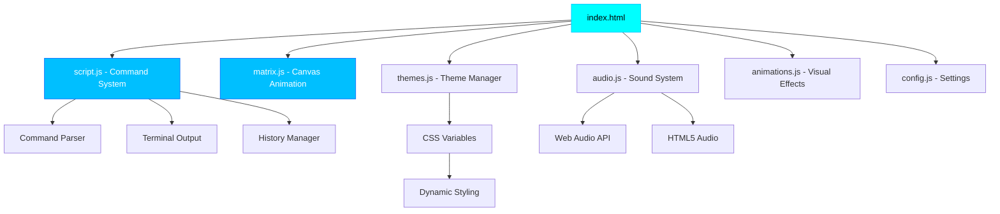

# 🦉 Matrix Owl Terminal

An interactive cyberpunk terminal experience with matrix rain effects, multiple themes, and easter eggs.

[](https://noctuacoder.github.io/matrix-owl/)
[](https://github.com/NoctuaCoder)

## 🎯 Motivation

**Why build another terminal emulator?**

I wanted to create an immersive, retro-futuristic experience that combines the nostalgia of classic terminals with modern web technologies. The goal was to build something that's not just functional, but **visually stunning** and **interactive** - a terminal that makes you *want* to type commands.

This project showcases:
- **Canvas API mastery** for dynamic animations
- **Modular JavaScript architecture** for maintainability
- **Web Audio API** for synthesized sound effects
- **CSS custom properties** for instant theme switching
- **localStorage** for persistent user preferences

## 🏗️ Architecture



**Key Design Decisions:**
- **Modular ES6 modules** for clean separation of concerns
- **Event-driven architecture** for responsive interactions
- **CSS custom properties** for instant theme switching without re-rendering
- **Canvas-based matrix rain** for 60fps smooth animations

## 💼 Business Value

This project demonstrates **production-ready Frontend development skills** applicable to enterprise applications:

### Component Architecture
- **Modular design** with clear separation of concerns (command system, rendering, state management)
- **Reusable modules** that can be extracted and adapted for other projects
- **Scalable architecture** that supports easy feature additions

### State Management
- **Command history** with localStorage persistence
- **Theme preferences** saved across sessions
- **Configuration management** with user settings
- **Event-driven updates** for reactive UI changes

### Performance Optimization
- **Canvas rendering** at 60fps for smooth animations
- **Debounced event handlers** to prevent performance bottlenecks
- **Lazy loading** of audio assets
- **Efficient DOM manipulation** with minimal reflows

### User Experience
- **Keyboard-first interface** with full accessibility
- **Visual feedback** for all user actions
- **Error handling** with clear user messaging
- **Progressive enhancement** (works without JavaScript for basic content)

## 🔧 Technical Highlights

**Skills Demonstrated:**
- ✅ **Vanilla JavaScript (ES6+)**: Modules, async/await, destructuring, template literals
- ✅ **Canvas API**: Custom animations, particle systems, performance optimization
- ✅ **Web Audio API**: Synthesized sounds, volume control, audio context management
- ✅ **CSS Architecture**: Custom properties, CSS-in-JS patterns, responsive design
- ✅ **Event Handling**: Keyboard events, command parsing, history navigation
- ✅ **Browser APIs**: localStorage, requestAnimationFrame, Intersection Observer
- ✅ **Code Organization**: Modular architecture, separation of concerns, clean code principles

**Transferable to Corporate Projects:**
- Command-line interfaces for admin panels
- Interactive data visualizations
- Real-time monitoring dashboards
- Custom UI components for design systems
- Performance-critical animations

## 🌟 Features

### 💻 Interactive CLI
Type commands like `help`, `whoami`, `projects`, `neofetch`, and more. Full command history with ↑↓ navigation.

### 🎨 Dynamic Themes
Switch between 6 beautiful themes:
- **Matrix** - Classic cyan cyberpunk
- **Dark Purple** - Material Design inspired
- **Light Mode** - For daytime coding
- **Cyberpunk** - Neon pink and yellow
- **Ocean** - Deep blue aesthetics
- **Sunset** - Warm purple and orange

### 🌊 Matrix Rain Animation
Custom canvas animation with "digital rain" effects that sync with your theme.

### 🔊 Sound System
- Mechanical keyboard typing sounds
- Success/error audio feedback
- Ambient drone (optional)
- Volume control (0-100)

### ✨ Animations
- Auto-typing boot sequence
- Glitch effects on title
- Smooth theme transitions
- Rainbow text effects
- Pulse animations

### 🎮 Snake Game
Play the classic Snake game right in your terminal! Use WASD or arrow keys to control the snake, eat food to grow, and avoid hitting walls or yourself. Features high score tracking and pause functionality.

### 🥚 Easter Eggs
Try finding secret commands! Hints: `owl`, `sudo`, `hack`, `matrix [color]`

### 📱 Fully Responsive
Optimized for desktop, tablet, and mobile devices with touch-friendly controls.

## 🚀 Quick Start

### Try it Online
👉 **[Launch Terminal](https://noctuacoder.github.io/matrix-owl/)**

### Run Locally
```bash
git clone https://github.com/NoctuaCoder/matrix-owl.git
cd matrix-owl
python3 -m http.server 8000
# Visit http://localhost:8000
```

## ⌨️ Available Commands

### Navigation & Files
```bash
help              # Show all commands
ls                # List files
cat [file]        # Read a file
cd [dir]          # Change directory
pwd               # Print working directory
clear             # Clear terminal
history           # Show command history
```

### Information
```bash
whoami            # About the user
about             # Detailed bio with ASCII art
projects          # List featured projects
neofetch          # System information
date              # Current date/time
```

### Customization
```bash
theme list        # List available themes
theme [name]      # Apply a theme
theme random      # Random theme

sound on/off      # Toggle sounds
sound volume [N]  # Set volume (0-100)
sound ambient on  # Enable ambient sound
```

### Games
```bash
snake             # Play Snake game 🐍
```

### Special
```bash
exit              # Return to portfolio
owl               # 🦉 Easter egg
sudo [cmd]        # Try it and see...
hack              # Hacking simulation
matrix [color]    # Change matrix rain color
```

## 🛠️ Tech Stack

- **HTML5** - Canvas API for matrix rain
- **CSS3** - Custom properties for theming, animations, flexbox
- **JavaScript (ES6+)** - Modular architecture
- **Web Audio API** - Dynamic sound generation
- **localStorage** - Configuration persistence

## 📁 Project Structure

```
matrix-owl/
├── index.html       # Main HTML structure
├── style.css        # Responsive styles with CSS variables
├── script.js        # Command system and terminal logic
├── themes.js        # Theme definitions and switching
├── config.js        # Configuration and localStorage
├── animations.js    # Animation effects
├── audio.js         # Web Audio API integration
├── matrix.js        # Matrix rain canvas effect
├── snake.js         # Snake game implementation
└── README.md        # This file
```

## 🎯 Key Features Explained

### Theme System
Themes use CSS custom properties for instant switching. All colors, shadows, and glows update dynamically.

### Command History
Navigate previous commands with ↑ and ↓ arrow keys. History persists across sessions.

### Sound System
Uses Web Audio API for synthesized sounds (beeps, boops) and HTML5 Audio for typing effects.

### Responsive Design
Media queries optimize the experience for:
- Desktop (1920px+)
- Laptop (1366px)
- Tablet (768px)
- Mobile (480px)
- Mobile landscape

## 🤝 Contributing

Feel free to fork and add your own commands or themes!

1. Fork the project
2. Create your feature branch (`git checkout -b feature/AmazingFeature`)
3. Commit your changes (`git commit -m 'Add some AmazingFeature'`)
4. Push to the branch (`git push origin feature/AmazingFeature`)
5. Open a Pull Request

## 💡 Ideas for Expansion

- [x] ~~Snake game~~ ✅ Implemented!
- [ ] More games (Tetris, Pong, Breakout)
- [ ] Blog system (`blog list`, `blog read [id]`)
- [ ] GitHub API integration for live stats
- [ ] Custom theme creator
- [ ] More easter eggs
- [ ] Tab completion
- [ ] Command aliases
- [ ] Export terminal session

## 📜 License

This project is open source and available under the MIT License.

## 📊 GitHub Stats

<div align="center">

[](https://github.com/NoctuaCoder)

[](https://github.com/NoctuaCoder)

[](https://github.com/NoctuaCoder)

</div>

## 🦉 About NoctuaCoder

Digital Alchemist crafting celestial web experiences.

- 🐙 GitHub: [@NoctuaCoder](https://github.com/NoctuaCoder)
- 🌐 Portfolio: [noctuacoder.github.io](https://noctuacoder.github.io/NoctuaCoder/portfolio.html)
- ✨ Motto: *"Code by night, create by instinct"*

---

<div align="center">

**Made with 🦉 by NoctuaCoder**

*Beauty in every byte*

</div>
